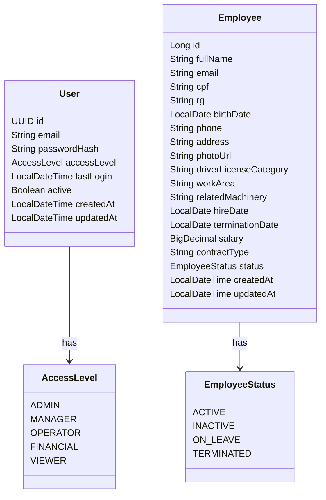

# 🌱 AgroSoft – Sistema de Gestão Agroindustrial

O **AgroSoft** é um sistema **full-stack** desenvolvido como **projeto pessoal** com foco em aprendizado prático, aplicação de **boas práticas de desenvolvimento**.

O sistema tem como objetivo auxiliar na **gestão operacional, financeira e analítica** de uma empresa agroindustrial, permitindo o controle de **usuários, funcionários, animais, máquinas, finanças e relatórios**, simulando um ambiente corporativo real.

---

## 🎯 Objetivo do Projeto

- Consolidar conhecimentos em **Java 8 + Spring Boot**
- Desenvolver **APIs REST** seguindo boas práticas
- Aplicar **POO, Clean Code e arquitetura em camadas**
- Trabalhar com **AngularJS** no frontend
- Implementar **autenticação e autorização com JWT**
- Praticar **testes unitários**
- Utilizar **Git Flow** e versionamento profissional
- Criar um projeto próximo da realidade do mercado

---

## 🔐 Funcionalidades Principais

### 👤 Autenticação e Usuários
- Login com **JWT**
- Controle de acesso por perfil:
    - `ADMIN`
    - `GERENTE`
    - `OPERADOR`
- Cadastro e gerenciamento de usuários

### 👷 Funcionários
- Cadastro de funcionários
- Definição de **cargo e salário**
- Controle de **status** (ativo / inativo)

### 🐄 Gestão de Animais
- Cadastro de animais (gado e outros)
- Tipo do animal
- Peso
- Data de entrada
- Status (ativo / vendido)

### 🚜 Máquinas e Veículos
- Cadastro de máquinas e veículos
- Status operacional
- Registro de custos de manutenção

### 💰 Financeiro
- Controle de **despesas e receitas**
- Categorias financeiras
- Consulta por período
- Relatórios consolidados

### 📊 Relatórios e Dashboards
- Total de despesas por período
- Total de receitas
- Quantidade de animais ativos
- Funcionários ativos
- Visualização de dashboards no frontend

---

## 🛠️ Tecnologias Utilizadas

### 🔙 Backend
- Java 8
- Spring Boot
- Spring MVC
- Spring Security + JWT
- Spring Data JPA
- Maven
- JUnit 5 / Mockito
- PostgreSQL
- MongoDB (relatórios e dados consolidados)

### 🎨 Frontend
- AngularJS
- JavaScript
- HTML5
- CSS3

### ⚙️ Infraestrutura e Ferramentas
- Git / GitHub
- Docker (opcional)
- Postman
- IntelliJ IDEA

---

## 🏗️ Arquitetura do Projeto

O projeto segue uma **arquitetura em camadas**, garantindo organização, escalabilidade e facilidade de manutenção:

- **Controller**  
  Responsável por expor a API REST e receber requisições HTTP.

- **Service**  
  Contém as regras de negócio da aplicação.

- **Repository**  
  Camada de acesso a dados.

- **DTO (Data Transfer Object)**  
  Responsável pela transferência segura de dados entre camadas.

- **Security**  
  Configurações de autenticação e autorização com JWT.

- **Exception**  
  Tratamento global de erros e exceções da aplicação.

---

## ▶️ Como Executar o Projeto

### Backend
```bash
# Clonar o repositório
git clone https://github.com/seu-usuario/agrosoft.git

# Acessar o projeto
cd agrosoft-backend

# Executar a aplicação
mvn spring-boot:run

```

## 📍 Diagrama

